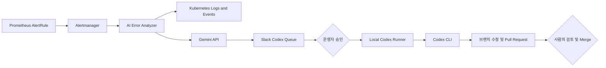

# ErrorOps / TalkKing Application

AWS EKS에서 운영되는 TalkKing 메신저와 AI 기반 Kubernetes 장애 대응 서비스를 담은 애플리케이션 저장소입니다. Prometheus Alert를 수신한 ErrorOps가 Kubernetes 로그와 이벤트를 수집하고, Gemini가 생성한 코드 수정 프롬프트를 Slack 승인 및 Local Codex Runner와 연결해 Pull Request 생성까지 자동화합니다.

## 서비스 구성

| 모듈 | 역할 | 포트 |
| --- | --- | --- |
| `talkking-chat` | 사용자 인증, 채팅방, WebSocket/STOMP 기반 실시간 채팅 | `8080` |
| `talkking-notification` | RabbitMQ 이벤트 소비 및 SSE 기반 알림 전송 | `8081` |
| `ai-error-analyzer` | Alertmanager Webhook 수신, Kubernetes 진단, Gemini 분석, Slack 작업 전달 | `8082` |

`talkking-chat`과 `talkking-notification`은 루트 Maven 멀티 모듈에 포함됩니다. `ai-error-analyzer`는 별도의 `pom.xml`을 사용하는 독립 Spring Boot 애플리케이션입니다.

## ErrorOps 흐름



1. Prometheus가 Pod 상태, 재시작, 리소스 사용량, 응답 지연 및 5XX 비율을 감지합니다.
2. Alertmanager가 `POST /api/v1/alerts`로 Alert를 전달합니다.
3. AI Error Analyzer가 대상 Pod의 상태, 최근 로그와 Kubernetes Events를 수집합니다.
4. Gemini가 장애 분석 결과와 Codex가 실행할 코드 수정 프롬프트를 생성합니다.
5. 심각도별 Slack 채널에 알림을 보내고 Codex Queue에는 프롬프트 파일을 업로드합니다.
6. 승인된 작업만 Local Codex Runner가 실행하며, 별도 브랜치와 Pull Request까지만 생성합니다.
7. 운영 반영과 Merge는 사람이 검토한 후 결정합니다.

동일한 Alert fingerprint는 Redis를 이용해 30분 동안 중복 처리를 제한합니다. 분석 결과와 처리 이력은 PostgreSQL Alert History DB에 저장하고 Micrometer 지표는 Prometheus에 노출합니다.

## 주요 기술

- Java 17, Spring Boot 3.5
- Spring WebSocket, STOMP, SSE
- Spring Security, JWT
- RabbitMQ, Redis
- MySQL, PostgreSQL, Spring Data JPA
- Kubernetes Java Client
- Prometheus, Micrometer, Alertmanager
- Gemini API, Slack API
- Docker, GitHub Actions, Amazon ECR

## 저장소 구조

```text
team2-talkKing-app/
├── talkking-chat/          # 채팅 및 사용자 서비스
├── talkking-notification/  # 비동기 알림 서비스
├── ai-error-analyzer/      # ErrorOps 장애 분석 서비스
├── .github/workflows/      # CI 및 이미지 배포
├── docker-compose.yml
└── pom.xml                 # Chat/Notification 멀티 모듈
```

## 로컬 실행

### 요구 사항

- JDK 17
- Docker 및 Docker Compose
- MySQL 8
- Redis
- RabbitMQ

### Chat 및 Notification 빌드

```powershell
.\mvnw.cmd clean test
.\mvnw.cmd clean package
```

RabbitMQ와 애플리케이션을 Docker Compose로 실행할 수 있습니다.

```powershell
docker compose up --build
```

Chat Service는 MySQL과 Redis 연결 정보가 추가로 필요합니다.

```powershell
$env:SPRING_DATASOURCE_URL="jdbc:mysql://localhost:3306/talkking"
$env:SPRING_DATASOURCE_USERNAME="root"
$env:SPRING_DATASOURCE_PASSWORD="password"
$env:SPRING_DATA_REDIS_HOST="localhost"
$env:SPRING_RABBITMQ_HOST="localhost"
.\mvnw.cmd -pl talkking-chat spring-boot:run
```

### AI Error Analyzer 실행

```powershell
$env:ALERT_DATASOURCE_URL="jdbc:postgresql://localhost:5432/errorops"
$env:ALERT_DATASOURCE_USERNAME="postgres"
$env:ALERT_DB_PASSWORD="password"
$env:REDIS_HOST="localhost"
$env:GEMINI_API_KEY="your-api-key"
$env:GEMINI_MODEL="gemini-2.5-flash"

.\mvnw.cmd -f ai-error-analyzer\pom.xml spring-boot:run
```

Slack 연동에는 용도에 따라 다음 환경변수를 설정합니다.

```text
SLACK_GENERAL_WEBHOOK_URL
SLACK_CRITICAL_WEBHOOK_URL
SLACK_WARNING_WEBHOOK_URL
SLACK_INFO_WEBHOOK_URL
SLACK_CODEX_QUEUE_WEBHOOK_URL
SLACK_CODEX_BOT_TOKEN
SLACK_CODEX_CHANNEL_ID
```

운영 환경에서는 환경변수를 저장소에 직접 기록하지 않고 AWS Secrets Manager와 External Secrets Operator를 통해 Kubernetes Secret으로 주입합니다.

## 주요 엔드포인트

| 서비스 | 엔드포인트 | 설명 |
| --- | --- | --- |
| Chat | `/api/users/signup`, `/api/users/login` | 회원가입 및 로그인 |
| Chat | `/api/chat/rooms` | 채팅방 생성 및 조회 |
| Chat | `/ws` | WebSocket/SockJS 연결 |
| Notification | `/api/notifications/subscribe/{userId}` | SSE 알림 구독 |
| AI Analyzer | `/api/v1/alerts` | Alertmanager Webhook 수신 |
| 공통 | `/actuator/health` | 애플리케이션 상태 확인 |
| 공통 | `/actuator/prometheus` | Prometheus 메트릭 |

## 관련 저장소

- [Application](https://github.com/CLD-05/team2-talkKing-app)
- [Kubernetes Config](https://github.com/CLD-05/team2-talkKing-config)
- [Infrastructure](https://github.com/CLD-05/team2-talkKing-infra)

## 안전 원칙

ErrorOps의 AI 자동화는 운영 환경에 직접 반영하지 않습니다. Codex Runner는 승인된 작업만 실행하며 코드 수정, 검증, 커밋, Push 및 Pull Request 생성까지만 담당합니다. `dev` 직접 Push, 자동 Merge, 인프라 삭제와 같은 고위험 작업은 차단하고 최종 반영은 반드시 사람의 검토를 거칩니다.
